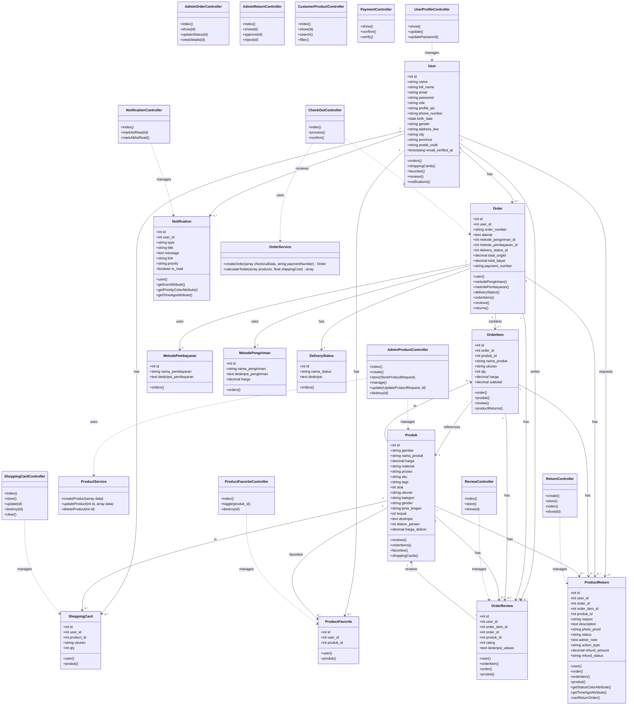
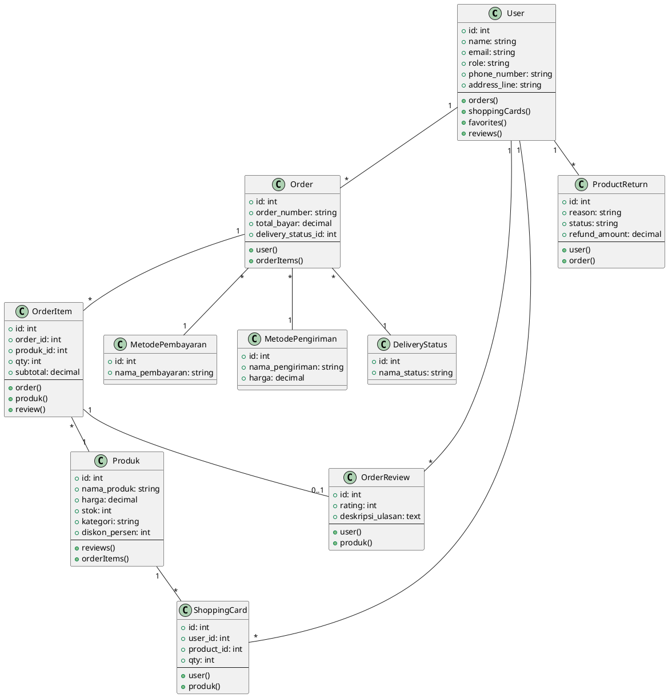

# Class Diagram Motifnesia

## Cara Pakai:
1. Buka website: **https://mermaid.live**
2. Copy script di bawah ini
3. Paste ke editor di website tersebut
4. Diagram akan muncul otomatis
5. Bisa di-export ke PNG/SVG

---

## Script Mermaid Class Diagram:



---

## Alternative: PlantUML

Kalau mau pakai PlantUML, bisa juga di: **https://plantuml.com/plantuml**



---

## ERD Database (Bonus)

Kalau mau ERD khusus database, pakai: **https://dbdiagram.io**

```dbml
Table users {
  id int [pk, increment]
  name varchar
  email varchar [unique]
  password varchar
  role varchar
  phone_number varchar
  address_line text
  created_at timestamp
}

Table produk {
  id int [pk, increment]
  nama_produk varchar
  harga decimal
  stok int
  kategori varchar
  diskon_persen int
  created_at timestamp
}

Table orders {
  id int [pk, increment]
  user_id int [ref: > users.id]
  order_number varchar [unique]
  metode_pengiriman_id int [ref: > metode_pengiriman.id]
  metode_pembayaran_id int [ref: > metode_pembayaran.id]
  delivery_status_id int [ref: > delivery_status.id]
  total_bayar decimal
  created_at timestamp
}

Table order_items {
  id int [pk, increment]
  order_id int [ref: > orders.id]
  produk_id int [ref: > produk.id]
  qty int
  harga decimal
  subtotal decimal
}

Table order_reviews {
  id int [pk, increment]
  user_id int [ref: > users.id]
  order_item_id int [ref: > order_items.id]
  produk_id int [ref: > produk.id]
  rating int
  deskripsi_ulasan text
  created_at timestamp
}

Table shopping_card {
  id int [pk, increment]
  user_id int [ref: > users.id]
  product_id int [ref: > produk.id]
  qty int
  ukuran varchar
}

Table product_favorite {
  id int [pk, increment]
  user_id int [ref: > users.id]
  produk_id int [ref: > produk.id]
}

Table returns {
  id int [pk, increment]
  user_id int [ref: > users.id]
  order_id int [ref: > orders.id]
  order_item_id int [ref: > order_items.id]
  produk_id int [ref: > produk.id]
  reason varchar
  status varchar
  refund_amount decimal
  created_at timestamp
}

Table metode_pembayaran {
  id int [pk, increment]
  nama_pembayaran varchar
}

Table metode_pengiriman {
  id int [pk, increment]
  nama_pengiriman varchar
  harga decimal
}

Table delivery_status {
  id int [pk, increment]
  nama_status varchar
}

Table notifications {
  id int [pk, increment]
  user_id int [ref: > users.id]
  type varchar
  title varchar
  message text
  is_read boolean
  created_at timestamp
}
```
