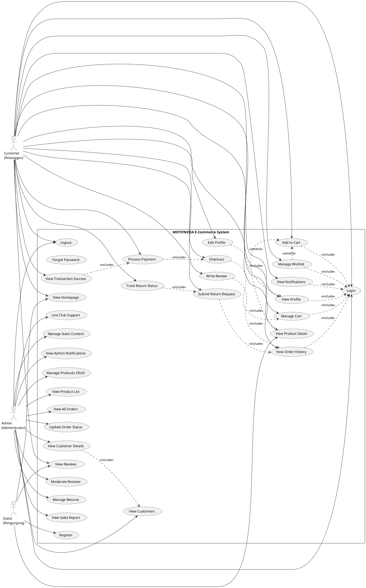

# 📋 DAFTAR FITUR APLIKASI MOTIFNESIA

**Platform E-Commerce Batik & Produk Lokal Indonesia**  
**Tanggal:** 19 Desember 2025

---

## 🔐 SISTEM AUTHENTICATION & AUTHORIZATION

### 1. **Login & Registrasi**
- **Fungsi:** Sistem autentikasi untuk customer dan admin
- **Fitur:**
  - Login dengan email dan password
  - Registrasi akun baru customer
  - Validasi input (email, password strength)
  - Session management
- **Tujuan:** Memberikan akses terproteksi ke fitur aplikasi berdasarkan role user
- **Middleware:** Guest Middleware (redirect jika sudah login)

**Deskripsi:** Fitur Login & Registrasi adalah gerbang utama untuk mengakses aplikasi Motifnesia. Customer baru dapat mendaftar dengan mudah menggunakan email dan password yang akan divalidasi untuk keamanan. Sistem ini menggunakan session management untuk menjaga user tetap login dan memisahkan akses antara admin dan customer dengan strict role-based authentication. User yang sudah login akan otomatis diarahkan ke dashboard masing-masing.

### 2. **Logout**
- **Fungsi:** Keluar dari sesi login
- **Tujuan:** Mengakhiri sesi user dengan aman

**Deskripsi:** Fitur Logout memungkinkan user untuk keluar dari akun mereka dengan aman. Sesi login akan dihapus dari server dan user akan diarahkan kembali ke halaman login, memastikan tidak ada sesi yang tersisa yang bisa disalahgunakan.

### 3. **Forgot Password**
- **Fungsi:** Reset password jika lupa
- **Tujuan:** Recovery akses akun user

**Deskripsi:** Fitur Forgot Password memberikan solusi bagi user yang lupa password mereka. Melalui proses verifikasi email, user dapat mereset password lama dan membuat password baru untuk kembali mengakses akun mereka tanpa kehilangan data.

---

## 👤 FITUR CUSTOMER (Front-End)

### **A. KATALOG & PRODUK**

#### 1. **Homepage**
- **Fungsi:** Halaman utama aplikasi
- **Fitur:**
  - Slideshow banner promosi
  - Display produk terbaru/featured
  - Kategori produk
  - Search & filter produk
- **Tujuan:** Landing page untuk menarik customer dan menampilkan produk unggulan
- **Akses:** Public (semua orang), Admin di-block

**Deskripsi:** Homepage adalah halaman pertama yang dilihat pengunjung saat mengakses Motifnesia. Dilengkapi dengan slideshow banner promosi yang menarik, display produk terbaru dan unggulan, serta fitur search dan filter untuk memudahkan customer menemukan produk batik favorit mereka. Homepage dirancang sebagai showcase produk lokal Indonesia yang dapat diakses oleh siapa saja.

#### 2. **Product Detail**
- **Fungsi:** Halaman detail produk
- **Fitur:**
  - Gambar produk (zoom/preview)
  - Deskripsi lengkap (material, proses pembuatan, ukuran, jenis lengan)
  - Harga & diskon
  - Rating & review produk
  - Stok tersedia
  - Button: Add to Cart, Add to Favorites
- **Tujuan:** Memberikan informasi lengkap produk untuk membantu keputusan pembelian
- **Akses:** Public (semua orang)

**Deskripsi:** Halaman Product Detail memberikan informasi komprehensif tentang setiap produk batik yang dijual. Customer dapat melihat gambar produk dengan fitur zoom, membaca deskripsi detail tentang material dan proses pembuatan, melihat rating dari pembeli lain, dan langsung menambahkan produk ke keranjang atau wishlist. Semua informasi yang dibutuhkan untuk membuat keputusan pembelian tersedia di satu halaman.

---

### **B. SHOPPING & CHECKOUT**

#### 3. **Shopping Cart (Keranjang Belanja)**
- **Fungsi:** Manajemen produk yang akan dibeli
- **Fitur:**
  - Lihat daftar produk di keranjang
  - Update quantity produk
  - Hapus produk dari keranjang
  - Kalkulasi total harga otomatis
  - Button checkout
- **Tujuan:** Mempermudah customer mengatur produk sebelum checkout
- **Akses:** Customer only (butuh login)

**Deskripsi:** Shopping Cart adalah tempat customer mengumpulkan dan mengatur produk yang ingin dibeli. Customer dapat dengan mudah mengubah jumlah produk, menghapus item yang tidak diinginkan, dan melihat kalkulasi total harga secara real-time. Fitur ini memudahkan customer untuk merencanakan pembelian mereka sebelum melanjutkan ke proses checkout.

#### 4. **Checkout**
- **Fungsi:** Proses pemesanan produk
- **Fitur:**
  - Input alamat pengiriman
  - Pilih metode pengiriman (JNE, JNT, SiCepat, dll)
  - Pilih metode pembayaran (Transfer Bank, E-Wallet, COD)
  - Summary order (produk, ongkir, total)
  - Validasi data checkout
- **Tujuan:** Finalisasi pembelian dengan informasi lengkap pengiriman dan pembayaran
- **Akses:** Customer only

**Deskripsi:** Halaman Checkout adalah tahap finalisasi pembelian di mana customer melengkapi informasi pengiriman dan memilih metode pembayaran. Sistem menyediakan berbagai pilihan ekspedisi dan metode pembayaran yang fleksibel. Customer dapat melihat ringkasan lengkap order termasuk ongkos kirim dan total pembayaran sebelum mengkonfirmasi pesanan, dengan validasi data untuk memastikan semua informasi terisi dengan benar.

#### 5. **Payment (Pembayaran)**
- **Fungsi:** Halaman konfirmasi pembayaran
- **Fitur:**
  - Detail order yang harus dibayar
  - Informasi rekening/metode pembayaran
  - Upload bukti pembayaran (jika transfer)
  - Countdown timer pembayaran
- **Tujuan:** Memproses pembayaran order customer
- **Akses:** Customer only

**Deskripsi:** Halaman Payment menampilkan detail order yang harus dibayar beserta instruksi pembayaran yang jelas. Customer dapat mengupload bukti transfer jika menggunakan metode transfer bank, dan sistem dilengkapi dengan countdown timer untuk memberikan batas waktu pembayaran. Fitur ini memastikan proses pembayaran berjalan tertib dan tertracking dengan baik.

#### 6. **Transaction Success**
- **Fungsi:** Halaman konfirmasi transaksi berhasil
- **Fitur:**
  - Order ID & invoice
  - Summary pembelian
  - Status pesanan
  - Estimasi pengiriman
- **Tujuan:** Konfirmasi ke customer bahwa order berhasil dibuat
- **Akses:** Customer only

**Deskripsi:** Halaman Transaction Success adalah konfirmasi bahwa pesanan customer berhasil dibuat. Customer mendapatkan Order ID dan invoice yang dapat digunakan untuk tracking pesanan. Halaman ini menampilkan ringkasan lengkap pembelian, status pesanan saat ini, dan estimasi waktu pengiriman, memberikan ketenangan bahwa transaksi telah berhasil diproses.

---

### **C. WISHLIST & FAVORIT**

#### 7. **Favorites/Wishlist**
- **Fungsi:** Menyimpan produk favorit
- **Fitur:**
  - Lihat daftar produk favorit
  - Tambah/hapus produk dari favorit
  - Quick add to cart dari favorit
  - Notifikasi jika ada diskon produk favorit
- **Tujuan:** Memudahkan customer menyimpan produk yang diminati untuk dibeli nanti
- **Akses:** Customer only

**Deskripsi:** Fitur Favorites/Wishlist memungkinkan customer menyimpan produk yang menarik perhatian mereka untuk dibeli di lain waktu. Customer dapat dengan mudah mengelola daftar wishlist mereka dan bahkan mendapatkan notifikasi ketika ada diskon untuk produk favorit. Fitur quick add to cart membuat proses pembelian produk favorit menjadi lebih cepat dan efisien.

---

### **D. REVIEW & RATING**

#### 8. **Product Reviews**
- **Fungsi:** Lihat dan buat review produk
- **Fitur:**
  - Lihat semua review produk
  - Filter review (rating, terbaru, terlama)
  - Rating 1-5 bintang
- **Tujuan:** Memberikan social proof dan membantu keputusan pembelian
- **Akses:** Public (lihat), Customer only (buat review)

**Deskripsi:** Product Reviews memberikan platform bagi customer untuk membaca dan memberikan ulasan tentang produk. Pengunjung dapat melihat rating dan review dari pembeli lain untuk membantu keputusan pembelian, sementara customer yang sudah membeli dapat memberikan penilaian bintang 1-5 dan komentar. Review dapat difilter berdasarkan rating atau waktu untuk memudahkan mencari informasi yang relevan.

#### 9. **Order Reviews (Purchase History)**
- **Fungsi:** Review produk yang sudah dibeli
- **Fitur:**
  - Review produk dari order history
  - Upload foto produk yang diterima
  - Rating kualitas produk
  - Testimoni pengalaman belanja
  - Edit/delete review sendiri
- **Tujuan:** Meningkatkan kredibilitas toko dengan testimoni real customer
- **Akses:** Customer only (yang sudah beli)

**Deskripsi:** Order Reviews memungkinkan customer yang telah menerima produk untuk memberikan review berdasarkan pengalaman nyata mereka. Customer dapat mengupload foto produk yang diterima sebagai bukti visual, memberikan rating, dan menulis testimoni detail tentang kualitas produk dan pengalaman belanja. Review dapat diedit atau dihapus oleh customer yang membuatnya, memastikan fleksibilitas dalam memberikan feedback.

---

### **E. USER PROFILE & ACCOUNT**

#### 10. **User Profile**
- **Fungsi:** Halaman profil customer
- **Fitur:**
  - Lihat informasi akun (nama, email, phone, alamat)
  - Purchase history (riwayat pembelian)
  - Order tracking
  - Favorit produk
  - Review yang sudah dibuat
- **Tujuan:** Dashboard personal customer untuk manage akun dan riwayat belanja
- **Akses:** Customer only

**Deskripsi:** User Profile adalah dashboard personal customer yang menampilkan semua informasi akun dan aktivitas belanja. Customer dapat melihat riwayat pembelian lengkap, melakukan tracking pesanan yang sedang berjalan, mengakses daftar produk favorit, dan melihat semua review yang pernah dibuat. Halaman ini menjadi pusat kontrol untuk semua aktivitas customer di platform Motifnesia.

#### 11. **Edit Profile**
- **Fungsi:** Update data profil customer
- **Fitur:**
  - Edit foto profil
  - Update data personal (nama, email, phone, tanggal lahir, gender)
  - Update alamat pengiriman (alamat, kota, provinsi, kode pos)
  - Change password
- **Tujuan:** Memungkinkan customer update informasi pribadi
- **Akses:** Customer only

**Deskripsi:** Edit Profile memberikan customer kontrol penuh untuk mengelola informasi pribadi mereka. Customer dapat mengupdate foto profil, data personal seperti nama dan kontak, mengelola alamat pengiriman untuk memudahkan checkout di masa depan, dan mengubah password untuk keamanan. Semua perubahan data divalidasi untuk memastikan akurasi informasi.

---

### **F. NOTIFIKASI**

#### 12. **Notifications**
- **Fungsi:** Sistem notifikasi untuk customer
- **Fitur:**
  - Notifikasi order status (dikemas, dikirim, diterima)
  - Notifikasi promo & diskon
  - Notifikasi review reply dari admin
  - Mark as read/unread
  - Clear all notifications
- **Tujuan:** Keep customer updated tentang aktivitas akun dan order
- **Akses:** Customer only

**Deskripsi:** Sistem Notifications memastikan customer selalu terupdate dengan semua aktivitas penting di akun mereka. Customer menerima notifikasi real-time tentang perubahan status pesanan, promo menarik, dan balasan review dari admin. Notifikasi dapat dikelola dengan mudah melalui fitur mark as read/unread dan clear all, menjaga inbox notifikasi tetap terorganisir.

---

### **G. RETURN & REFUND**

#### 13. **Product Returns (Customer)**
- **Fungsi:** Pengajuan retur/pengembalian produk
- **Fitur:**
  - Form pengajuan retur dengan alasan
  - Upload foto produk bermasalah
  - Pilih produk dari order history
  - Track status retur (pending, approved, rejected)
  - Cancel pengajuan retur
- **Tujuan:** Memberikan garansi kepuasan customer dengan sistem retur
- **Akses:** Customer only (yang sudah beli)

**Deskripsi:** Product Returns memberikan jaminan kepuasan kepada customer dengan sistem pengembalian produk yang terstruktur. Customer yang menerima produk bermasalah dapat mengajukan retur dengan mengisi form alasan dan mengupload foto sebagai bukti. Sistem tracking memungkinkan customer memantau status pengajuan retur mereka, dan customer juga dapat membatalkan pengajuan jika berubah pikiran.

---

## 👨‍💼 FITUR ADMIN (Back-End)

### **A. MANAJEMEN PRODUK**

#### 1. **Manajemen Produk (Product Management)**
- **Fungsi:** CRUD produk batik/lokal
- **Fitur:**
  - Grid view semua produk dengan gambar
  - Add new product (form lengkap)
  - Edit produk (modal edit dengan semua field)
  - Delete produk (dengan konfirmasi)
  - Upload gambar produk
  - Set harga & diskon (kalkulasi otomatis)
  - Manage stok produk
  - Kategori & tags produk
  - Detail produk (material, proses, ukuran, jenis lengan, SKU)
- **Tujuan:** Admin dapat mengelola katalog produk dengan mudah
- **Akses:** Admin only

**Deskripsi:** Manajemen Produk adalah pusat kontrol admin untuk mengelola seluruh katalog produk batik Motifnesia. Admin dapat menambah produk baru dengan form lengkap termasuk upload gambar, mengatur harga dan diskon dengan kalkulasi otomatis, mengelola stok, dan mengatur kategori produk. Interface grid view memudahkan admin melihat semua produk sekaligus, sementara fitur edit dan delete dilengkapi dengan konfirmasi untuk mencegah kesalahan.

#### 2. **Daftar Produk (Product List)**
- **Fungsi:** View list produk dalam format tabel
- **Fitur:**
  - Tabel list semua produk
  - Sort & filter produk
  - Quick view produk
- **Tujuan:** View alternatif untuk melihat produk dalam format list/table
- **Akses:** Admin only

**Deskripsi:** Daftar Produk menyediakan tampilan alternatif dalam format tabel yang lebih ringkas untuk melihat katalog produk. Admin dapat dengan mudah melakukan sorting dan filtering produk berdasarkan berbagai kriteria, serta menggunakan fitur quick view untuk melihat detail produk secara cepat tanpa harus membuka halaman edit lengkap.

---

### **B. MANAJEMEN CUSTOMER**

#### 3. **Daftar Pelanggan (Customer Management)**
- **Fungsi:** Kelola data customer
- **Fitur:**
  - Lihat semua customer terdaftar
  - Detail customer (nama, email, phone, alamat, join date)
  - Riwayat pembelian customer
  - Total spending per customer
  - Delete customer (hapus akun)
- **Tujuan:** Admin monitoring dan manage database customer
- **Akses:** Admin only

**Deskripsi:** Daftar Pelanggan memberikan admin akses penuh ke database customer untuk monitoring dan pengelolaan. Admin dapat melihat detail lengkap setiap customer termasuk informasi kontak dan riwayat pembelian mereka. Fitur total spending per customer membantu admin mengidentifikasi customer loyal, dan admin juga memiliki kontrol untuk menghapus akun customer jika diperlukan.

---

### **C. ULASAN & RATING**

#### 4. **Ulasan Produk (Product Reviews Admin)**
- **Fungsi:** Moderasi review customer
- **Fitur:**
  - Lihat semua review produk
  - Detail review (rating, komentar, foto review)
  - Filter review berdasarkan produk/rating
  - Review statistics (average rating, total reviews)
- **Tujuan:** Monitor feedback customer dan moderate review yang inappropriate
- **Akses:** Admin only

**Deskripsi:** Ulasan Produk Admin memungkinkan admin untuk memonitoring dan memoderasi semua review yang diberikan customer. Admin dapat melihat detail lengkap setiap review termasuk foto yang diupload customer, menggunakan filter untuk mencari review spesifik, dan melihat statistik rating produk. Fitur ini penting untuk menjaga kualitas review dan mengidentifikasi feedback penting dari customer.

---

### **D. ORDER & PENGIRIMAN**

#### 5. **Status Pengiriman (Order Status Management)**
- **Fungsi:** Update dan monitor status pesanan
- **Fitur:**
  - Lihat semua order dengan status
  - Update status order:
    - Pending Payment
    - Payment Confirmed
    - Processing (dikemas)
    - Shipped (dikirim)
    - Delivered (diterima)
    - Cancelled
  - Order timeline/history
  - Filter order by status
  - Order details (customer, produk, alamat, payment)
- **Tujuan:** Admin tracking dan update progress order customer
- **Akses:** Admin only

**Deskripsi:** Status Pengiriman adalah sistem manajemen order yang comprehensive untuk admin. Admin dapat memantau semua pesanan dari berbagai status, mengupdate progress pengiriman secara real-time dari pending payment hingga delivered, dan melihat timeline lengkap perjalanan setiap order. Fitur filter memudahkan admin fokus pada order dengan status tertentu, sementara detail order lengkap membantu admin mengelola pengiriman dengan akurat.

---

### **E. RETURN & KOMPLAIN**

#### 6. **Kelola Retur (Returns Management)**
- **Fungsi:** Handle pengajuan retur customer
- **Fitur:**
  - Lihat semua pengajuan retur
  - Review detail retur (alasan, foto, order detail)
  - Approve/reject retur
  - Update status retur
  - Delete retur yang selesai
  - Communication dengan customer
- **Tujuan:** Admin menangani complain dan retur dengan sistematis
- **Akses:** Admin only

**Deskripsi:** Kelola Retur memberikan admin tools lengkap untuk menangani pengajuan pengembalian produk dari customer. Admin dapat mereview setiap pengajuan retur dengan detail lengkap termasuk alasan dan foto bukti, kemudian memutuskan untuk approve atau reject retur tersebut. Sistem ini memungkinkan admin berkomunikasi dengan customer dan mengelola status retur hingga selesai, memastikan penanganan komplain yang profesional dan sistematis.

---

### **F. LAPORAN & ANALYTICS**

#### 7. **Laporan Penjualan (Sales Report)**
- **Fungsi:** Dashboard analytics penjualan
- **Fitur:**
  - Total penjualan (daily, monthly, yearly)
  - Jumlah order
  - Produk terlaris
  - Revenue statistics
  - Chart & graphs
  - Filter by date range
  - Export report (Excel/PDF)
- **Tujuan:** Admin monitoring performa bisnis dan membuat keputusan strategis
- **Akses:** Admin only

**Deskripsi:** Laporan Penjualan adalah dashboard analytics komprehensif yang memberikan insight mendalam tentang performa bisnis. Admin dapat melihat total penjualan dalam berbagai periode waktu, mengidentifikasi produk terlaris, dan menganalisis revenue melalui chart dan graphs yang visual. Fitur filter berdasarkan date range dan export ke Excel/PDF memudahkan admin membuat laporan untuk analisis lebih lanjut dan pengambilan keputusan strategis.

---

### **G. KOMUNIKASI**

#### 8. **Live Chat Support**
- **Tujuan:** Memberikan support langsung ke customer untuk pertanyaan/bantuan
- **Akses:** Admin only

**Deskripsi:** Live Chat Support memfasilitasi komunikasi real-time antara admin dan customer untuk memberikan bantuan instant. Admin dapat melihat daftar chat aktif, mengakses riwayat percakapan untuk konteks, dan menggunakan quick replies untuk menjawab pertanyaan umum dengan cepat. Fitur typing indicator dan notifikasi chat baru memastikan admin dapat merespons customer dengan cepat dan profesional.

---

### **H. NOTIFIKASI SISTEM**

#### 9. **Notifikasi Sistem (Admin Notifications)**
- **Fungsi:** Alert untuk aktivitas penting
- **Fitur:**
  - Notifikasi order baru
  - Notifikasi pembayaran masuk
  - Notifikasi retur baru
  - Notifikasi review baru
  - Mark as read/unread
  - Mark all as read
  - Clear read notifications
  - Delete notifications
- **Tujuan:** Admin tidak miss aktivitas penting di toko
- **Akses:** Admin only

**Deskripsi:** Notifikasi Sistem Admin adalah alert center yang memastikan admin selalu terinformasi tentang aktivitas penting di toko. Admin menerima notifikasi instant untuk order baru, pembayaran yang masuk, pengajuan retur, dan review baru dari customer. Sistem manajemen notifikasi yang lengkap dengan fitur mark as read, mark all as read, dan delete membantu admin menjaga inbox notifikasi tetap terorganisir dan tidak melewatkan aktivitas bisnis penting.

---

### **I. KELOLA KONTEN STATIS**

#### 10. **Kelola Konten Statis (Static Content Management)**
- **Fungsi:** Manage konten homepage & landing page
- **Fitur:**
  - **Slideshow Management:**
    - Create/edit/delete slide banner
    - Upload gambar slide
    - Set judul & deskripsi slide
    - Order/sequence slide
  - **About Us Content:**
    - Edit konten About Us
    - Update visi misi
  - **Icon/Feature Section:**
    - Manage icon features (Fast Delivery, Secure Payment, dll)
- **Tujuan:** Admin update konten promosi dan informasi toko tanpa coding
- **Akses:** Admin only

**Deskripsi:** Kelola Konten Statis adalah content management system yang memungkinkan admin mengupdate tampilan dan konten website tanpa perlu coding. Admin dapat mengelola slideshow banner promosi dengan upload gambar dan atur urutan tampilan, mengedit konten About Us termasuk visi misi perusahaan, dan mengatur icon features yang ditampilkan di homepage. Fitur ini memberikan fleksibilitas kepada admin untuk selalu menjaga konten website tetap fresh dan relevan dengan campaign marketing terbaru.

---

## 🔒 SISTEM KEAMANAN (MIDDLEWARE)

### 1. **Admin Middleware**
- **Fungsi:** Proteksi halaman admin
- **Rule:** Hanya user dengan role 'admin' yang bisa akses `/admin/*`
- **Redirect:** Customer → Home Page

### 2. **Customer Middleware**
- **Fungsi:** Proteksi halaman customer yang butuh login
- **Rule:** Hanya user dengan role 'customer' yang sudah login
- **Redirect:** 
  - Admin → Admin Dashboard
  - Guest → Login Page

### 3. **Guest Middleware**
- **Fungsi:** Proteksi halaman auth (login/register)
- **Rule:** Hanya untuk user yang belum login
- **Redirect:**
  - Admin → Admin Dashboard
  - Customer → Home Page

### 4. **Block Admin Middleware**
- **Fungsi:** Block admin dari akses homepage customer
- **Rule:** Admin tidak bisa akses `/homePage`
- **Redirect:** Admin → Admin Dashboard

---

## 📊 DATABASE MODELS

1. **User** - Data customer & admin
2. **Produk** - Katalog produk batik
3. **ShoppingCard** - Keranjang belanja
4. **Order** - Pesanan customer
5. **OrderItem** - Detail item dalam order
6. **OrderReview** - Review dari pembelian
7. **Review** - Review produk general
8. **ProductFavorite** - Wishlist customer
9. **ProductReturn** - Pengajuan retur
10. **Notification** - Sistem notifikasi
11. **Checkout** - Data checkout
12. **CheckoutItem** - Item dalam checkout
13. **MetodePembayaran** - Metode payment
14. **MetodePengiriman** - Metode shipping
15. **DeliveryStatus** - Status pengiriman
16. **StatusTransaksi** - Status transaksi
17. **OrderStatusHistory** - History perubahan status
18. **KontenSlideShow** - Banner slideshow
19. **KontenAboutUs** - Konten About Us
20. **KontenIcon** - Icon features

---

## 🎯 FITUR UNGGULAN

### ✅ **Customer Experience**
- 🛍️ **Easy Shopping:** Add to cart, wishlist, smooth checkout
- 📦 **Order Tracking:** Real-time status pesanan
- ⭐ **Review System:** Rating & testimoni dengan foto
- 🔄 **Return System:** Garansi retur jika tidak puas
- 🔔 **Real-time Notification:** Update order status instant
- 💬 **Live Chat Support:** Bantuan langsung dari admin

### ✅ **Admin Features**
- 📊 **Sales Analytics:** Dashboard lengkap performa penjualan
- 🏷️ **Discount Management:** Set diskon produk otomatis calculate
- 🚚 **Order Management:** Track & update status pengiriman
- 👥 **Customer Database:** Kelola customer & purchase history
- 📝 **Content Management:** Update slideshow & konten tanpa coding
- 💬 **Customer Support:** Live chat dengan customer

### ✅ **Security**
- 🔐 **Role-based Access:** Admin & customer terpisah strict
- 🛡️ **Middleware Protection:** Semua routes terproteksi
- ✔️ **Form Validation:** Input validation lengkap
- 🔒 **Password Hashing:** Password encrypted secure

---

## 📈 TEKNOLOGI & FRAMEWORK

- **Backend:** Laravel 12.34.0
- **PHP:** 8.2.12
- **Database:** MySQL (via Laravel Eloquent ORM)
- **Frontend:** Blade Templates
- **CSS:** Tailwind CSS
- **JavaScript:** Vanilla JS (untuk interaktivity)
- **Authentication:** Laravel Session-based Auth
- **Middleware:** Custom Laravel Middleware

---

## 📝 CATATAN

Project ini adalah **E-Commerce Platform khusus Batik & Produk Lokal Indonesia** dengan nama **MOTIFNESIA**.

**Keunggulan:**
1. ✅ Sistem terorganisir dengan separation of concerns (Customer vs Admin)
2. ✅ Security yang ketat dengan middleware system
3. ✅ User-friendly interface untuk customer
4. ✅ Powerful admin dashboard untuk manage bisnis
5. ✅ Complete e-commerce features (cart, checkout, payment, tracking, review, return)

---

**Dokumentasi dibuat:** 19 Desember 2025  
**Total Fitur Customer:** 13 Fitur Utama  
**Total Fitur Admin:** 10 Fitur Utama  
**Total Models/Database Tables:** 20 Tables

---

## 📐 USE CASE DIAGRAM

**Cara Pakai:**
1. Buka: https://www.plantuml.com/plantuml/uml/
2. Copas script di bawah
3. Klik "Submit" atau auto-reload
4. Download PNG/SVG

**Penjelasan Relationship:**

**<<include>> (Garis Putus-putus ke ATAS)** - Use case WAJIB dipanggil:
- Add to Cart → WAJIB Login dulu
- Checkout → WAJIB ada isi Cart dulu  
- Process Payment → WAJIB Checkout dulu
- Write Review → WAJIB punya Order History dulu
- Submit Return → WAJIB punya Order History dulu

**<<extend>> (Garis Putus-putus)** - Use case OPSIONAL:
- View Product Detail → bisa extend ke Add to Cart (kalau mau beli)
- Manage Wishlist → bisa extend ke Add to Cart (kalau mau beli dari wishlist)

**Access Level:**
- **Guest (Public):** Homepage, Product Detail, View Reviews, Register
- **Customer (Login Required):** Shopping, Profile, Review, Return, Notifications
- **Admin (Admin Only):** Manage Products, Orders, Customers, Analytics, Content
